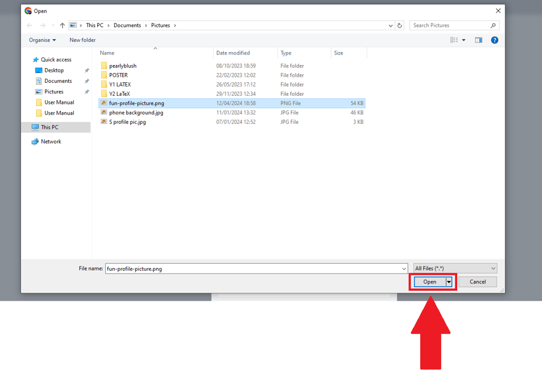
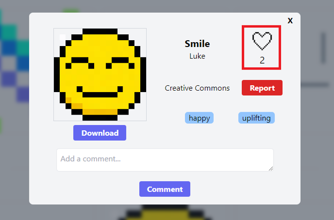
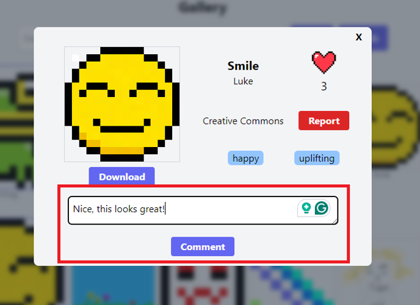
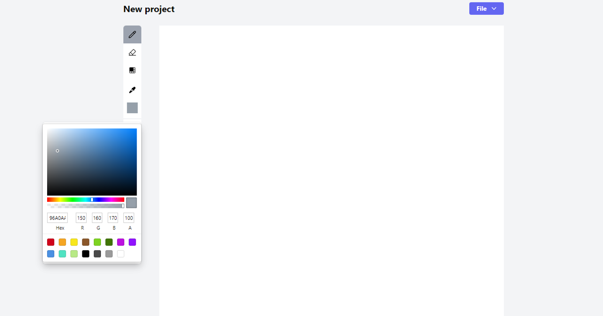

# PixelVault User Manual 

By Sukh Sareen, Luke Bradley, Matt Davies, Josh Kay, Ryan Raulia, and Elliott Watkiss-Leek.

# Contents

1. [Introduction](#introduction)
2. [Overview](#overview)
    - [Features of the System](#features-of-the-system)
    - [Accessing the Application](#accessing-the-application)
    - [Requirements](#requirements)
3. [Profile Management](#profile-management)
    - [Creating an Account](#creating-an-account)
    - [Deleting Account](#deleting-account)
    - [Changing Password](#changing-password)
    - [Signing In](#signing-in)
    - [Account Recovery (Forgotten Password)](#account-recovery-forgotten-password)
    - [Editing your Profile](#editing-your-profile)
        - [Uploading a Profile Picture](#uploading-a-profile-picture)
4. [Community Interaction](#community-interaction)
    - [Looking up a User](#looking-up-a-user)
    - [Following a User](#following-a-user)
    - [Liking a Post](#liking-a-post)
    - [Commenting on a Post](#commenting-on-a-post)
    - [Liking a Comment](#liking-a-comment)
    - [Removing a Comment](#removing-a-comment)
5. [Creating Artwork (Using the Editor)](#creating-artwork-using-the-editor)
    - [Tools and Uses](#tools-and-uses)
        - [Pencil](#pencil)
        - [Colour Picker](#colour-picker)
        - [Eyedropper](#eyedropper)
        - [Eraser](#eraser)
    - [Undo/Redo](#undoredo)
        - [Undoing](#undoing)
        - [Redoing](#redoing)
    - [Working Offline](#working-offline)
    - [Save/Load Project](#saveload-project)
        - [Saving a Project](#saving-a-project)
        - [Loading a Project](#loading-a-project)
    - [Exporting Artwork](#exporting-artwork)
        - [Export to a PNG](#export-to-a-png)
    - [Project Management](#project-management)
        - [Creating a New Project](#creating-a-new-project)
        - [Deleting a Project](#deleting-a-project)
        - [Renaming your Project](#renaming-your-project)
        - [Opening a Project for Collaboration](#opening-a-project-for-collaboration)
            - [Inviting Collaborators](#inviting-collaborators)
            - [Viewing Collaborators](#viewing-collaborators)
            - [Removing Collaborators](#removing-collaborators)
            - [Accepting a Collaboration Invitation](#accepting-a-collaboration-invitation)
    - [Post Management](#post-management)
        - [Updating Post Details](#updating-post-details)
        - [Removing a Post](#removing-a-post)
6. [Explore Page](#explore-page)
    - [Browsing Posts](#browsing-posts)
        - [Searching](#searching)
    - [Filtering](#filtering)
        - [By Author](#by-author)
        - [By Tag](#by-tag)
        - [By Licence](#by-licence)
    - [Sorting](#sorting)
        - [By Likes](#by-likes)
        - [By Title](#by-title)
        - [Most Recent](#most-recent)
        - [Ordering](#ordering)
    - [Viewing a Post's Details](#viewing-a-posts-details)
7. [Contact Us](#contact-us)
    - [Reporting](#reporting)
        - [Report a User](#report-a-user)
        - [Report a Post](#report-a-post)
        - [Report a Comment](#report-a-comment)
    - [Providing Feedback / Contacting Customer Service](#provide-feedback--contact-customer-service)
8. [Admin](#admin)
    - [Hide Post](#hide-post)
    - [Hide Comment](#hide-comment)
    - [Ban User](#ban-user)
9. [FAQ](#faq)
    - [What is Pixel Art?](#what-is-pixel-art) 
    - [What exactly is Licensing?](#what-exactly-is-licensing)
    - [What Kind of Licences Can I Choose for my Artwork?](#what-kind-of-licences-can-i-choose-for-my-artwork)

# Introduction

Hello and welcome to PixelVault! PixelVault is a web-based Pixel art editor and gallery, which  allows users to create, share and sell [pixel art](#what-is-pixel-art). 

This user manual serves to provide a detailed overview of PixelVault, its functionalities and step-by-step instructions to help you navigate and use the system.

**This document is intended for:**
- Beginners who want to start creating pixel art or are familiarising themselves with the system's features.
- Artists who wish to share their pixel art.
- Individuals looking to join a community of like-minded people.

We have developed PixelVault to make the process of creating and distributing pixel art as easy as possible. As well as to provide artists with the tools necessary to list and license their artwork with ease.

The system is comprised of **two** key components:

-  **Collaborative Editor:** A real-time collaborative canvas, allowing multiple users to edit the same project simultaneously.
- **Sharing Platform:** 
    - A website through which artists can publish their artwork and share it with other users, according to a licence of their choosing.
    - All users can then engage with the community, for instance by following other artists, or liking and/or commenting on posts.

# Overview

Here we take a look at the features of PixelVault.

## Features of the system

- **Pixel art editor:**
    - **Tools:** Users can edit the canvas using a 'pencil' tool (with a variable brush-stroke size).
	- **Collaboration:** Users can invite other artists to collaborate on a project; changes made by collaborators are reflected in real-time.
	- **Export:** Artwork can be easily exported as PNG files.
- **Gallery:**
    - **Search and Filter:** Search published works by attributes such as title, author, and tags.
    - **Sorting:** Artwork can be sorted by likes, recency of publication, or title.
    - **Licencing:** Artists can select a licence when publishing their artwork giving them control over
                     how their work may be used.
- **Community:**
    - **Account Registration:** Users can sign up with an email, username, and password, allowing them to log in and engage with the platform.
    - **Reporting System:** Users have the power to report any malicious or offensive content, triggering a review process by the admin team, ensuring that the community remains safe and respectful!
    - **Administrative Oversight:** Admins also have the authority to remove any such malicious or offensive content.
    - **Social Engagement:** Users can follow their favourite artists to track their work and view their new posts.
    - **Content Promotion:** The visibility of posts is influenced by the number of likes, the more likes a post receives, the higher it will appear on the explore page!

## Accessing the Application

PixelVault can be accessed by navigating to [https://159.65.213.208](https://159.65.213.208) using any modern browser (see [Requirements](#requirements) for more details), no additional software needs to be installed. 

The Graphical User Interface (GUI) has been designed to be user-friendly and to provide quick access to all available tools and features.

## Requirements
- **OS:** Compatible with the latest versions of Windows, macOS and Linux.
- **Browser:** Best performance on Google Chrome, Mozilla Firefox, Safari and Microsoft Edge.
- **Hardware:** There are no specific hardware requirements beyond those of the browsers listed.
- **Network:** Stable internet connection.

# Profile Management

This section will help you to manage your PixelVault profile.

## Creating an account

To use the collaborative editor and interact with the community, you will need to create an account:

1. Click the '**Log In**' button on the homepage.  

2. Click the '**Don't have an account? Sign up!**' link, located at the bottom of the pop-up:  

3. Enter a username, password, email address, and date of birth.  
  (Be sure to choose a strong password which meets our security requirements!)
4. Click on the '**Register**' button.  

5. If the entered details are valid, congratulations you will now have created a PixelVault account! 
    You will then be automatically logged in and redirected to the **Explore** page.

*Note:* You *must* be 16 years or above to create a PixelVault account.

## Deleting Account 

*Note:* this will **irreversibly** delete your account and all data associated with it.

To delete your account, simply:
1. Click your profile picture in the top-right corner of the screen.  

2. From the dropdown, select '**My Profile**'.  

3. Once on your profile page, select '**Options**', which can be found near the top of the page.  

4. At the bottom of the options pop-up, click the '**Delete Account**' button.  

5. Confirm that you do indeed wish to delete your account.  

6. If deletion has successfully been carried out, you will receive the following pop-up:  

## Changing Password
 
Here's how to change your password on PixelVault:

1. Navigate to your profile by clicking on your profile icon in the top-right corner of the screen, and selecting '**My Profile**' from the drop-down menu.  

2. Click on '**Options**' which is located near your profile username.  

3. In the Options menu you will find the section labelled '**Set New Password**'.  

4. Type your new password into this field. Make sure your password is strong and unique!

5. Once your new password is entered, click the '**Save**' button, located directly next to the '**Set New Password**' field, to apply the changes.

 If you receive the following confirmation:  

Your password will be updated immediately!

## Signing In

To access your account:

1. Click the '**Log In**' button in the top-right corner of the homepage.  

2. Enter your username and password.

3. If the provided credentials are correct, you will now be signed in to your account and redirected to the **Explore** page.
    - Otherwise you will get the following error:  
    

## Account Recovery (Forgotten Password)

If you have forgotten your password: 

1. Click the '**Log In**' button on the homepage.  

2. Click the '**Forgot your Password?**' link, located at the bottom of the pop-up.  

3. You will be redirected to your email application, with the recipient address and subject pre-filled:  

4. Ensure you are sending the email from the **same** email address linked to your PixelVault Account.
5. Click '**Send**'.
6. Our technical team will verify your details and, if appropriate, send back a temporary password for your account. You should change this as soon as you have logged back into the system.

## Editing your profile 

Customising your profile is quick and easy!

1. Head to your profile by clicking on your profile icon in the top-right corner of the screen, and selecting '**My Profile**' from the drop-down menu.  

2. Once you are on your profile page, click the '**Options**' button, which is located next to your username.  

3. This will open a pop-up:  

Through which you can edit your profile by:
- Adding a [profile picture](#uploading-a-profile-picture) 
- Setting a biography.
- Adding your social media handles.
- [Changing your password](#changing-password).
- [Deleting your account](#deleting-account).

### Uploading a Profile Picture

To give your profile your own personal charm, upload a profile picture! 

Doing this is simple:

1. Navigate to [Profile Options](#editing-your-profile)  

2. Click on your profile picture, which you can find at the top of the pop-up:  

3. A file explorer window will open, choose your image, select it and click '**Open**'.  

4. A confirmation pop-up will appear if the image has been successfully uploaded:  

- Otherwise you will see the following:  

If successful, upon refresh your profile picture will be updated!

*Note:* You can only upload .png images.

# Community Interaction 

Whether it's a like or a comment, show your appreciation by interacting with users and their artwork!

## Looking up a User

If you want to view the profile of a user - perhaps a new artist you have discovered, or just a friendly commenter - simply click their username, and this will take you to their profile page. 

## Following a User

A fan of someone's artwork? To follow your favourite artist:

1. Visit the user's profile that you wish to follow.
2. Simply click the '**Follow**' button on their profile page.  

## Liking a Post

Show your appreciation for artwork:

1. Click on the post you want to like.
2. Click the '**like**' button, which is represented as a heart icon, to like the post.  

3. Your like will be counted and displayed!  

## Commenting on a Post

Interact with the community by sharing your feedback:

1. Select the post you want to comment on.
2. Enter your comment in the text box and click '**Comment**' to share it with the world.  
  

## Liking a Comment

Has a comment resonated with you? Let the sender know by liking it!

1. Navigate to the comment you wish to like.
2. Click the heart icon to the right of the comment's text.  

3. The heart icon will now be filled in, indicating that you have liked this comment.  

## Removing a Comment

Users have the ability to remove their own comments on posts.

Here's how to remove a comment:

1. Navigate to the comment that you posted, that you wish to delete
2. To delete, click on the '**Bin**' icon:

3. A pop-up will appear asking you to confirm your decision. Click '**Ok**' to proceed. Otherwise click '**Cancel**' if you change your mind.

4. Once confirmed, the comment will be permanently removed from the platform.

*Note:* This action can not be undone, so make sure you are **certain** before deleting.

# Creating Artwork (Using the Editor)

Below you will find detailed instructions on how to use the editor to its full potential!

To use the editor, simply click on the 'Edit' button located on the top banner.

You will be prompted to either begin a new project, or [open an existing one](#loading-a-project).

## Tools and Uses

The editor provides an array of tools, which can be found in the left-hand sidebar of
the editor:  

Note that the currently-selected tool is indicated with a grey background.

### Pencil

The Pencil tool allows for precise pixel placement. 

1. Select the Pencil tool, represented by the pencil icon (✏️).
2. Click on the canvas to draw.

### Colour Picker

Our Colour Picker allows you to choose from a wide spectrum of colours, including specific Hex or RGB values.

1. Open the colour picker by clicking on the currently-selected colour.  

2. A colour selection pop-up will appear.  

3. Here you can select the desired colour by adjusting the hue, saturation and lightness;
  or you can directly input a specific RGBA/Hex value.
4. Once you have selected or input a colour, it will become active.

### Eye Dropper

The Eye Dropper tool allows you to copy the colour of a particular pixel on the canvas. 

1. Select the Eye Dropper tool, represented by a pipette icon:  

2. Move the cursor to the pixel with the colour you wish to select
3. Click on the pixel to select it. The colour of the pixel will now be your selected colour.

### Eraser

To remove unwanted pixels:

1. Select the Eraser tool, represented by the eraser icon:  

2. Simply click or click and drag over the pixels you wish to erase.

## Undo/Redo

### Undoing

If you make a mistake, or simply change your mind about an edit:

1. Click the '**Undo**' Button, represented by an arrow curving to the left:  

2. Alternatively you can use the command: **Ctrl + Z**.
3. Each time you either click or use the command, the last action you took will be reversed.

### Redoing

To reapply an action that you have undone:

1. Click the '**Redo**' Button, represented by an arrow curving to the right:  

2. Alternatively you can use either of the commands: **Ctrl + Shift + Z**, or **Ctrl + Y**.
3. Each time you either click or use the command, the last action you undid, will be re-applied.

*Note*: The history for the Undo and Redo actions is not retained once the editor is closed or the page is refreshed.

## Working Offline

You do not need to take any extra steps to work 'offline', when you first open a
blank canvas, this will be offline. This means that your work will not be saved,
so be careful not to lose your work by refreshing the page.

Note that you can switch to an 'online' canvas at any point by [saving the project](#saving-a-project),
though this will require you to have an account and be logged in.

## Save/Load Project

### Saving a Project

To save your current artwork:

1. Click on the 'File' button, located above the canvas then the '**Save as Project**' button from the drop-down menu.  

2. A prompt will appear asking you to name your project.  

3. After you have entered a name, click on the '**OK**' button to confirm.
4. Congratulations! Your project will be saved to your PixelVault account.

Please note that you must be signed in, in order to save your artwork
(Of course, you can still create art without an account, and [export it](#exporting-artwork)).

### Loading a Project

If you have saved a project and later wish to return to it, you can simply:
1. Click the '**Edit**' button from the navigation bar at the top of the screen.  

2. From the options presented, click '**Or, open an existing one**'.   

3. Find the project you wish to edit from the list presented.  

4. To load the project for editing, simply click its title. This will open the
   editor and allow you to edit this project.

## Exporting Artwork

PixelVault allows you to export your artwork from the editor for ease of sharing.

### Export to a PNG

To export your artwork as a PNG image:

1. First of all, ensure that you have opened the editor (see [Loading a Project](#loading-a-project)) 
2. Click on the '**File**' button, located on the top right-hand side of the canvas.
3. A drop-down menu will appear, click on '**Export**'.  

4. The '**PNG**' format of your artwork will start downloading and be saved to the downloads folder.  
  
Alternatively, depending on the settings of your browser, you may instead be prompted
   to choose a destination for the file.

# Project Management

Here is how to handle different aspects of your pixel art projects!

## Creating a new project

1. Click on '**Edit**', located on the top banner.  

2. You will be greeted with a pop-up, enter your desired canvas height and width in pixels and click '**Open**'.  

3. You can now begin creating your artwork!

*Note:* The max value for both height and width is 256.

## Deleting a Project

1. Navigate to the editor, and select '**open an existing project**'.  

2. Identify the project you would like to delete, and simply click the bin (🗑️) icon.  

3. You will be asked to confirm that you wish to delete this project, after doing so, the project will be deleted.  

## Renaming your Project

Changed your mind about what you named a project? Follow the steps below to rename it!

1. Navigate to the editor, and select '**Or open an existing one**'.  

2. Identify the project you would like to rename, and simply click the pencil (✏️) icon.  

3. You will then be prompted to enter a new name for the project, and this will then
   be the name of the project.  
   

## Opening a Project for Collaboration

### Inviting Collaborators

Want someone to join you in creating your artistic masterpiece?

1. You must first [load the project](#loading-a-project) you wish to invite collaborators to.
2. Once in the editor, click '**File**' and open the '**Collaborators**' menu.  

   See [Viewing Collaborators](#viewing-collaborators) for more details.
3.  Once the menu is open, in the text box enter the username of the user you want to invite and click the **'Invite'** button.
    - If the user exists and you receive the following confirmation:  
      
    then the invite has been sent!
    - If not, you will see:  
      
    In this case, the invite has not been sent. Check if you have spelt the username correctly.

### Viewing Collaborators

To view collaborators:

1. Load the saved project, see [Loading a Project](#loading-a-project) and [Saving a Project](#saving-a-project) for more details.
2. Click on the '**File**' button, located on the top right of the canvas.
3. A drop-down menu will appear, at the bottom of it will be **'Collaborators'**, click on it.  

4. A menu will appear, post the project's current collaborators.  

5. If this list is empty, then there are no collaborators for this project. 
   See [Inviting Collaborators](#inviting-collaborators) to invite users.

### Removing Collaborators

To remove collaborators:

1. Open the project you wish to manage the collaborators for.
2. Navigate to the collaborators menu. See [Viewing Collaborators](#viewing-collaborators) for more details.
3. Once the menu is open, there will be a red cross symbol located next to collaborators:  

4. Click it to remove them from the project.

### Accepting a Collaboration Invitation

1. To view your collaboration invitations, click the '**inbox**' icon in the right-hand
side of the top navigation bar:  

2. Your invitations will then be listed, for example:  

3. You can choose to either accept the invitation by clicking the '**tick**' (✔️), or
decline it by clicking the **cross** (❌).

# Post Management

## Updating Post Details

Changed your mind about the details? Don't fret, we've made changing post details a breeze:

1. First locate the post you want to change the details of.
    - You can either find your post on the '**Explore**' page, or potentially locate it by navigating to the '**My Profile**' page, it may be located under '**Most Recent**' or '**Most Liked**'.
2. Once located, click on it. A pop-up with details of your post will appear.
3. By clicking on the pen icons:  
  
you will be able to change the title, tags, and licence of your post.

*Note:* You can only change the details of *your* own artwork.

## Removing a Post

Want to remove your artwork? Follow these steps to delete it:

1. First, navigate to the post that you want to delete.
2. Once located, click on it. A pop-up with details of your post will appear.
3. By clicking on the red '**Delete**' button, a pop-up will appear asking you to confirm the deletion of your post.  

4. Click '**Yes**' to confirm, your post will now be deleted!

*Note:* Deleting your post is *permanent*, once deleted there's no going back!

# Explore Page

## Browsing Posts

To browse posts:

1. Navigate to the Explore page by clicking the '**Explore**' link on the top banner.

2. Scroll through the wide range of available artwork.

### Searching

1. Use the search bar located at the top of the Explore page to enter keywords, a title, and/or tags.

2. Press '**Enter**' or click the search icon to get matching results.

### Filtering

Refine your search to find posts that fit your specific needs!

To view and apply filters simply click the 'Filter' button, which is adjacent to the search bar on the Explore page.

Once open, this gives the following options:  
  

#### By Author

- Filter the results by the author's name to view all posts from that particular artist.
- To do this, once you have clicked on the 'Filter' button, enter the author's name into the 'Search by author...' search box.
- Alternatively, you can toggle the 'Only Show Followed Accounts' button, which will allow you to view posts of only the users you follow.

#### By Tag

- Simply type your tags in the search bar _after_ the title. 
- For instance, the following search matches the title 'Title' and the tags 'tag1' and 'tag2':  
  

- Note that you do not _need_ to input a title if you don't wish to - but, any tags must come **after** the title.

#### By Licence

- From the filter menu, simply select the type of licence you wish to filter to.

### Sorting

Posts can be sorted according to a particular attribute:

#### By Likes

- To sort posts according to their number of likes, select 'Likes'.

#### By Title

- To sort posts according to their title, select 'Title'.

#### Most Recent

- To sort posts according to their date of publication, select 'Most Recent'.

#### Ordering

- Note that the order of these results can be changed with the 'Order' option.

### Viewing a Post's Details

To take a closer look at a particular piece of art:

1. Clicking on a post will open a pop-up, which contains more information.
2. Here, you will find details such as the author's name, tags and licence details.
3. You can also view the artwork in a larger format, see the total number of likes and read other users' comments.

# Contact Us

## Reporting

*Note:* There is a 500-character limit on reports.

### Report a User

1. Visit the profile of the user you wish to report.
2. Click on the red 'Report' button, located next to the 'Follow' button.  

3. You will then be directed to the 'Report User' page.
4. Click on the drop-down menu and select the appropriate reason for the report.
    - If the reason is not listed, please ensure it is mentioned in the 'Additional Info' box.
5. In the 'Additional Info' box, please include any details which will help the moderation team to investigate this report.
6. Once you have selected the reason and added additional details, select the 'Submit Report' button to send your report to the PixelVault moderation team.  

### Report a Post

1. Navigate to the post you wish to report, by either browsing the Explore page or using the Search function.
2. Click on the post and click the red 'Report' button, located underneath the Like count (heart icon).  

3. You will be directed to the 'Report Post' page:
4. Click on the drop-down menu and select an appropriate reason for the report.
    - If the reason is not listed, please ensure it is mentioned in the 'Additional Info' box.
5. In the 'Additional Info' box, please include any details which will help the moderation team to investigate this report.
6. Once you have selected the reason and added additional details, select the 'Submit Report' button to send your report to the PixelVault moderation team.  

### Report a Comment

1. Navigate to the comment you wish to report.
2. Click on the red caution triangle:  

3. You will be directed to the 'Report Comment' page:
4. Click on the drop-down menu and select an appropriate reason for the report.
    - If the reason is not listed, please ensure it is mentioned in the 'Additional Info' box.
5. In the 'Additional Info' box, please include any details which will help the moderation team to investigate this report.
6. Once you have selected the reason and added additional details, select the 'Submit Report' button to send your report to the PixelVault moderation team.  

## Provide Feedback / Contact Customer Service

Whether it's a bug report or a general suggestion, your insight is invaluable to us.  

To contact customer service:

1. Scroll down and click on the 'Contact Us' link located on the bottom banner.
2. You will be directed to the 'Customer Service' feedback page.
3. Click on the drop-down menu and select an appropriate category for the feedback.
4. Once you have selected a reason and added some details, click the 'Submit Feedback' button to submit your feedback to the PixelVault team.  
  

# FAQ

## What is Pixel Art?

Pixel art is digital art, where images are built using pixels. Artists work in the constraints of a low resolution such as a 256x256 canvas.

Pixel art was predominantly used in the graphics of early video games and computer systems:

 

(**Credit**: 
Image Source: [Wikipedia - ChaosEngine1_s11.png](https://en.wikipedia.org/wiki/File:ChaosEngine1_s11.png)
Source: Chaheel Riens
License: Creative Commons Attribution-Share Alike 4.0 International)

 

(**Credit**: 
Image Source: [Wikipedia - Windows 95 First Run](https://en.wikipedia.org/wiki/File:Windows_95_at_first_run.png)
Author: Microsoft Corporation
License: Public domain)

In recent years, pixel art has had a resurgence in popularity. It is an art form that has found new appreciation with gamers, digital artists and enthusiasts!

 

(**Credit**: 
Image Source: papersplea.se
Author: Lucas Pope)

## What exactly is Licensing?

Licencing is a formal agreement that outlines how and where your artwork can be used by others.

## What kind of licences can I choose for my artwork?

PixelVault offers a range of licences that you can issue for your pixel art,
these are based on Creative Commons licences, the details of which are linked below.

- **Creative Commons** for public sharing  
  [https://creativecommons.org/publicdomain/zero/1.0/](https://creativecommons.org/publicdomain/zero/1.0/)

- **Commercial** for business purposes  
  [https://creativecommons.org/licenses/by/4.0/](https://creativecommons.org/licenses/by/4.0/)

- **Educational** for student use  
  [https://creativecommons.org/licenses/by/4.0/](https://creativecommons.org/licenses/by/4.0/)

---

# Administrator User Guide

This manual is aimed at administrators of the system. 

As an administrator, you have the responsibility of managing content and user interactions.
They have the key role of maintaining a friendly and welcoming environment for all users.

## Hide Post

Admins may need to hide posts for a variety of reasons, to do so:

1. Locate the post, by either browsing the Explore page or using the Search function.
2. Click on the post.
3. To hide the post, click on the red 'Hide' button, located under the Like count (heart icon).
4. If the post is successfully hidden you will receive a confirmation notification. The red 'Hide' button will now read 'Unhide'. To reinstate the post, simply click this button.

## Hide Comment

If a comment is offensive or inappropriate, then admins may choose to hide it:

1. Navigate to the comment you wish to hide.
2. To hide the comment, click on the eye icon:  
    
Located directly adjacent to the comment likes.
3. If the comment is successfully hidden you will see a confirmation notification. The eye icon will now have a diagonal line going through it. To unhide the comment, simply click this icon.

## Ban User

In some cases, it is most appropriate to ban a user, which can be carried out with the following steps:

1. Navigate to the user profile in question.
2. On their profile you will see a red 'Ban' button:   
    
 
3. To Ban the user click on this red 'Ban' button. 
4. Once clicked, you will see a pop-up asking you to confirm this action If you wish to proceed with the ban, click 'Ok', otherwise select cancel to stop this process.
5. If the User is successfully banned you will see a confirmation notification. The red 'Ban' button will now read 'Unban'. To reinstate the User, simply click this button.
